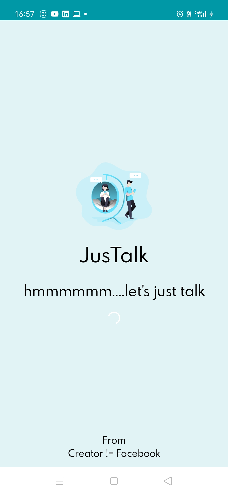
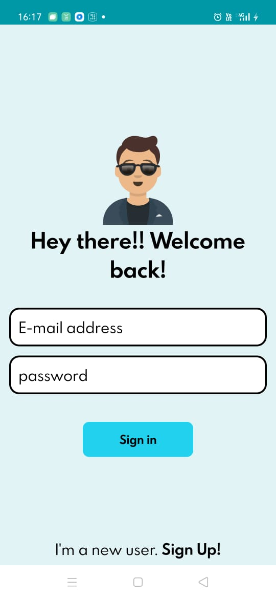
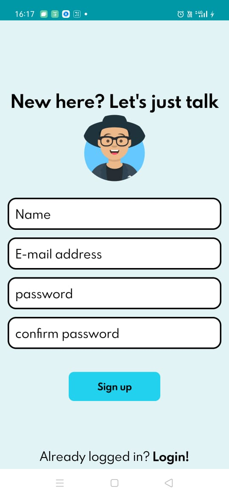
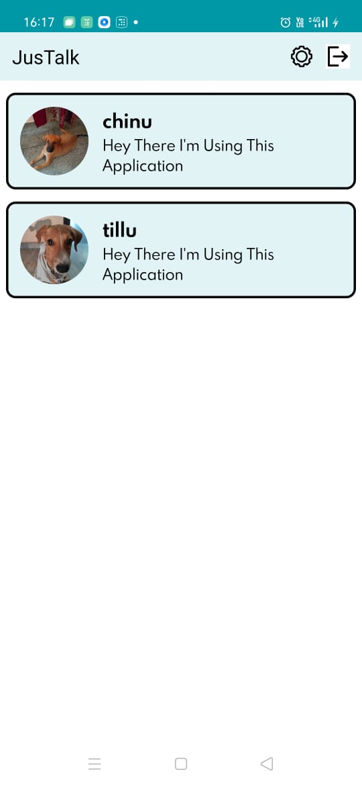
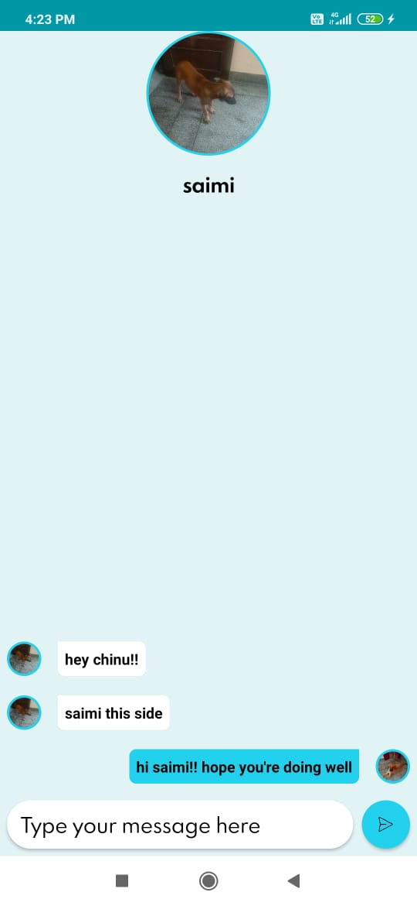
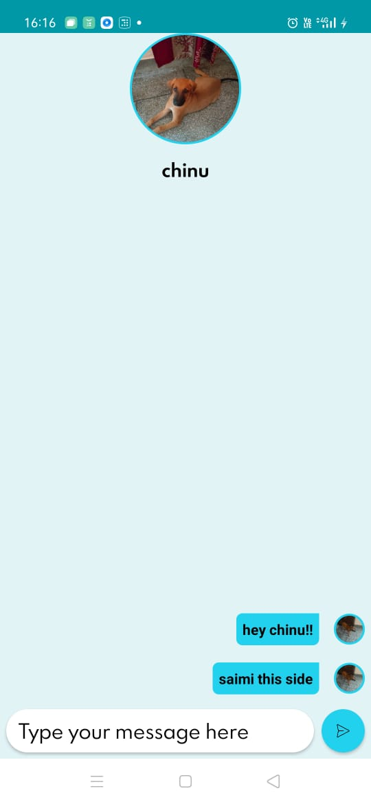
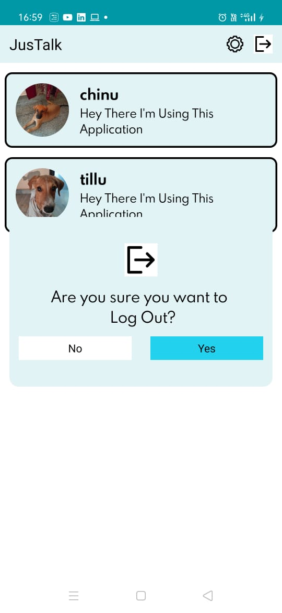
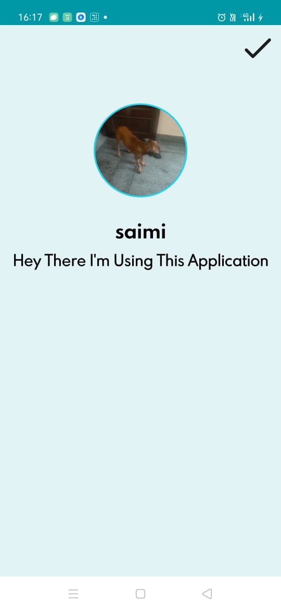

# JusChat
JusChat is a realtime one to one chat app made using Firebase and a feel good UI.

# How to implement?

1. Clone the repo or download the source code on your local machine.
2. Add the google-services.json and change the Firebase authorization key.

# Point to remember

While running the app make sure the Firebase storage and realtime
database rules are in Locked mode or Test mode.

# Screenshots

## Splash Screen, Login, Registration

        

## User List, Chats, Logout Dialog

            

## Settings

   

## Contributing

Contributions are always welcome!

If you have any suggestions or any feedback please create an issue.

Please adhere to this project's `code of conduct`.
 
## Installation 

If anyone needs the apk please, create an issue. 
    
## Support

For support, email jaiguptaa29@gmail.com .
